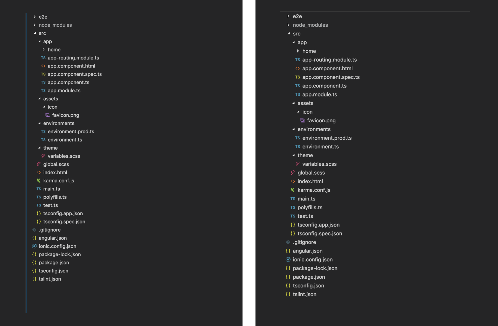
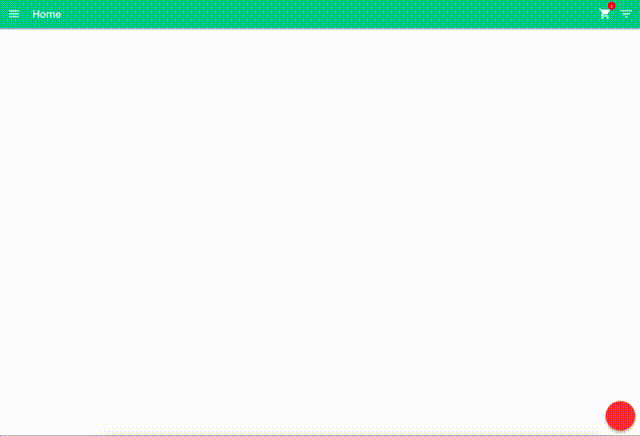

After a long wait, Ionic 4 is finally at beta. This basically means there won’t be major changes from what they have released. If you are brave enough, you can even start building your projects in Ionic 4 or migrate to Ionic 4. I am one of the brave ones, and I am LOVING IT! The biggest change in Ionic 4 is its use of Web Components, removing its dependency to Angular. That means you can build Ionic Apps using your favourite framework. In this tutorial, I’ll take you through the changes in Ionic 4 and how to migrate from Ionic 3 to 4.

## Ionic 4 Changes

### Ionic Angular Package

The package **ionic-angular** has moved to **@angular/ionic**. So move your imports to **@angular-ionic.**

### Project Structure

There are minor changes in the project structure. Have a look below



### Ionic Components

Most of the components went through a make-over because of the shift to Web Components. For example, **button** is now **ion-button**. Many of the components still keep their names. The team at Ionic has posted a [list of components](https://github.com/ionic-team/ionic/blob/master/angular/BREAKING.md#breaking-changes) that have breaking changes. There is also a [tool](https://github.com/ionic-team/v4-migration-tslint) to help you with the changes.

### Page Navigation

One of the biggest changes that will change the way you develop your apps is the way you navigate from one page to the next. In Ionic 2 and 3 you would use the NavController and call push or pop to navigate to the next page or go back to the previous one respectively. Things will be different in Ionic 4. It uses the Angular Router to navigate. Have a look at our Angular Router tutorial to familiarise yourself with it. The old way of doing things looks like this:

```typescript
goToExamplePage() {     
    this.navCtrl.push('ExamplePage', {'param1': param1, 'param2': param2}) 
} 
goBack() {     
    this.navCtrl.pop() 
}
```

This navigates to **“ExamplePage”** with a payload of **“data”**. 

```typescript
goToExamplePage() {     
    this.router.navigate(['example', 'param1', 'param2']) 
} 
goBack() {     
    this.location.back() 
}
```

> t**his.router** is an instance of Router imported from ‘@angular/router’
>
> **this.location** is an instance of Location imported from ‘@angular/common’

Another thing to note is that back buttons are not added automatically to your pages. You will have to add it by using the <ion-back-button> to the toolbar.

```html
<ion-header>     
    <ion-toolbar color="light">         
        <ion-buttons slot="start">             
            <ion-back-button></ion-back-button>         
        </ion-buttons>         
        <ion-title>Home</ion-title>     
    </ion-toolbar> 
</ion-header>
```

### Page Lifecycle

Ionic page life-cycles are also gone. You’ll be using the Angular life-cycles like **ngOnInit()** in place of **ionViewDidLoad()** from now on.

### Addition of Skeletons

Skeletons gives users the false impression that your application loads data fairly quickly. Besides using a standard picker, modern apps are using skeletons to improve their app’s designs. Here’s a comparison below of a standard spinner and skeleton implementation.


Non Skeleton Loading




Using Skeleton Implementation

### RxJS

Ionic 4 uses RxJS 6 which has some breaking changes when compared to RxJS 5. Use this [migration guide](https://github.com/ReactiveX/rxjs/blob/master/docs_app/content/guide/v6/migration.md) to update your RxJS code.

### Overlays

Alerts, Toasts, Popups and Modals (I hope I’m not leaving some out) are now called as promises. In Ionic 3, you would show an alert like this

```typescript
this.alertCtrl.create({...}).present()
```

This is how you do it in Ionic 4

```typescript
this.alertCtrl.create({...}).then(alert => {     alert.present() })
```

Or use await

```typescript
async displayAlert() {     let alert = this.alertCtrl.create({...})     await alert.present() }
```

> Always remember to specify **“async”** at the start of the function name, otherwise **“await”** will NOT work.

## Migrate to Ionic 4

This is a guideline to help you move your project to Ionic 4. Remember that not all projects are the same and there is no one way fits all method. You will have improvise depending on how you built your project. If you find a better way, please let me know in the comments section.

Start of by getting a list of breaking changes you need to fix. Open the project you want to migrate and install the lint rules

```
npm i -D @ionic/v4-migration-tslint
```

And then copy the contents below into the file **“ionic-migration.json”**

```json
{   "rulesDirectory": ["@ionic/v4-migration-tslint/rules"],   "rules": {     "ion-action-sheet-method-create-parameters-renamed": true,     "ion-alert-method-create-parameters-renamed": true,     "ion-datetime-capitalization-changed": true,     "ion-item-option-method-get-sliding-percent-renamed": true,     "ion-overlay-method-create-should-use-await": true,     "ion-overlay-method-present-should-use-await": true,     "ion-back-button-not-added-by-default": { "options": [true], "severity": "warning" },     "ion-button-attributes-renamed": true,     "ion-button-is-now-an-element": true,     "ion-chip-markup-has-changed": true,     "ion-fab-button-is-now-an-element": true,     "ion-fab-attributes-renamed": true,     "ion-fab-fixed-content": true,     "ion-col-attributes-renamed": true,     "ion-icon-attribute-is-active-removed": true,     "ion-item-is-now-an-element": true,     "ion-item-ion-label-required": true,     "ion-item-attributes-renamed": true,     "ion-item-divider-ion-label-required": true,     "ion-item-options-attribute-values-renamed": true,     "ion-item-option-is-now-an-element": true,     "ion-label-attributes-renamed": true,     "ion-list-header-ion-label-required": true,     "ion-menu-toggle-is-now-an-element": true,     "ion-navbar-is-now-ion-toolbar": true,     "ion-option-is-now-ion-select-option": true,     "ion-radio-attributes-renamed": true,     "ion-radio-slot-required": true,     "ion-radio-group-is-now-an-element": true,     "ion-range-attributes-renamed": true,     "ion-spinner-attribute-values-renamed": true,     "ion-tab-attributes-renamed": true,     "ion-text-is-now-an-element": true,     "ion-buttons-attributes-renamed": true   } }
```

Finally run the line below to view the errors you need to fix

```shell
npx tslint -c ionic-migration.json -p tsconfig.json
```

Please note that this will not show all the fixes you need to do, but it will save you a lot of time by finding some breaking changes for you. Since the project structure for Ionic 4 has changed, you need to create a [new project](https://www.ionicfire.com/installing-ionic/).

```shell
ionic start project-name blank --type=angular
```

1. Copy all your root level items (services, components etc) into src/app. If the folder you are using for your services/providers is “providers” – change it to “services”. Also add { providedIn: ‘root’} in the @Injectable() of your services.
2. Copy your global Sass styling from src/app/app.scss to src/global.scss.
3. For this step, you have two options. Either copy your pages into your app and fix the issues page by page, or you can use **ionic g page page-name** to generate your pages and then copy your code into every page. I prefer the latter option because it also modifies your app router for you as well as uses Ionic 4 markup changes to create your page.

That’s about it. Please not the changes above when fixing your app. Here’s a list to remind you.

- Use Angular Lifecycles
- NavController to the Angular Router
- RxJS has moved from RxJS 5 to RxJS 6
- Overlays are now called in overlays
- There are some breaking markup changes

Tell me how your migration went in the comments, I’d love to hear from you. And if there are any issues, I’ll be more than willing to help. Have Fun