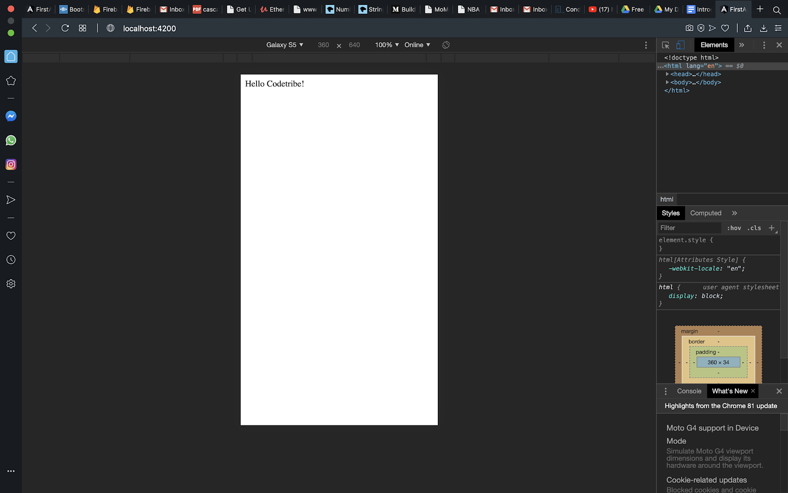

## Modal

Modals are object classes that we create in Angular. We create a folder named **Modal** in the **src** folder. 

As you can see from the example above, this is a modal class. 

## Mocks

Mocks are arrays that we create in angular for either testing. 

As you can see from the example above, you are able to import your "TEST_LIST" into the TestComponent.

Using the *NgFor you are able to loop through your list. The Output is the screenshot below.

