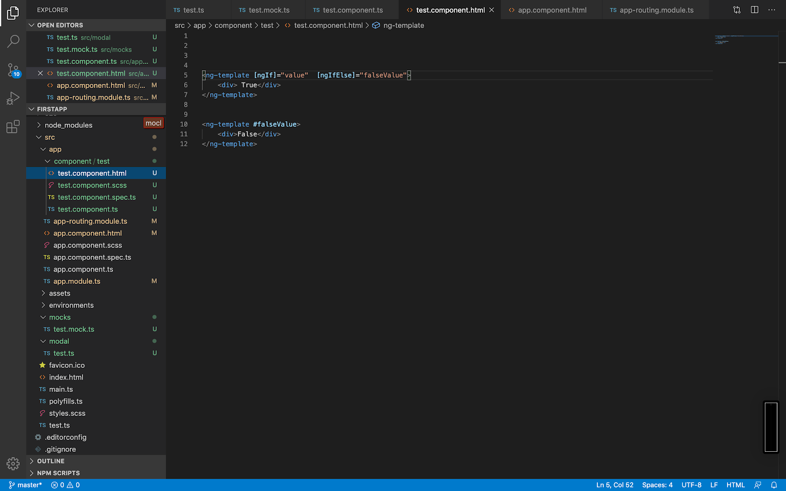

The ng-template is useful for being able to work display different states(views) of your html code based on certain conditions. For example;

**Task 1**
Redo the scenario above and change the value from true to false.

What output to you then get?

Right from this example above you would have got into a brief introduction to also being able to work with the *ngIf. As you may see from the example above, Angular has its own example Conditions Statements

The most common ones you will use throughout your programming Angular life are;

* *ngif
* ngFor
* [ngIf]
* [[ngIfElse]

You may refer to the documentation(https://angular.io/api/common/NgIf) 

**Task 2**

You are required to create your own portfolio website detailing all the projects you have done from varsity and CodeTribe lessons. 

1. Use either ng-boostrap or Angular Material
2. They should be a selector either a drop down or button that will allow you to change the state or the layout of your website
3. Portfolio website should be presentable and your creativity is all up to you.

Please note that they should be 2 different layouts that you build and the viewer of your profile should be able to change between different page layouts. 