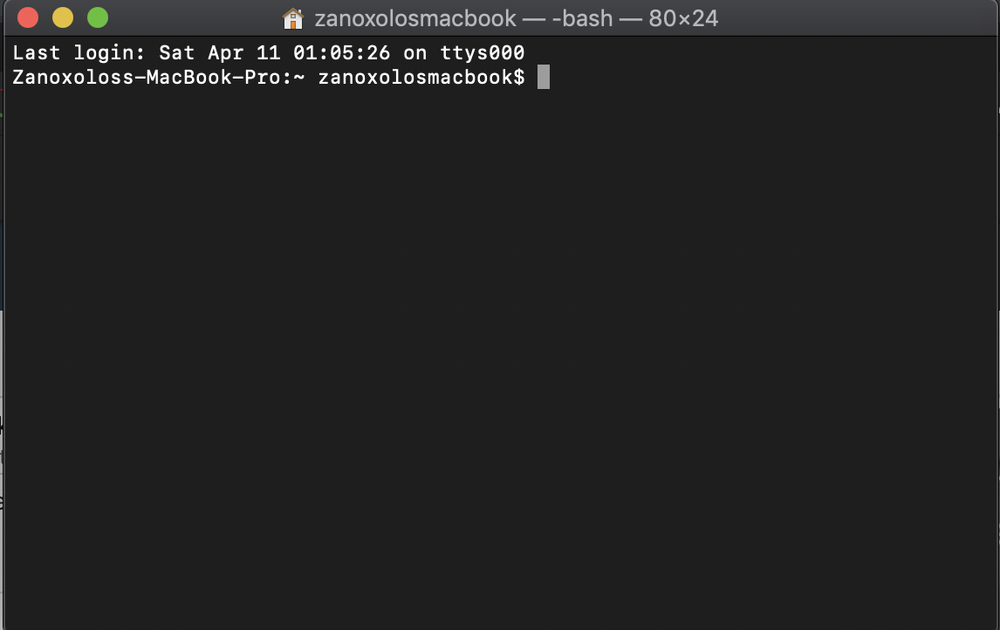
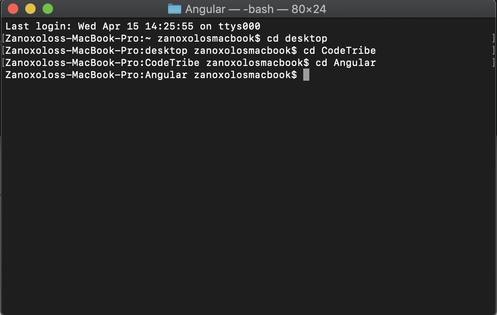
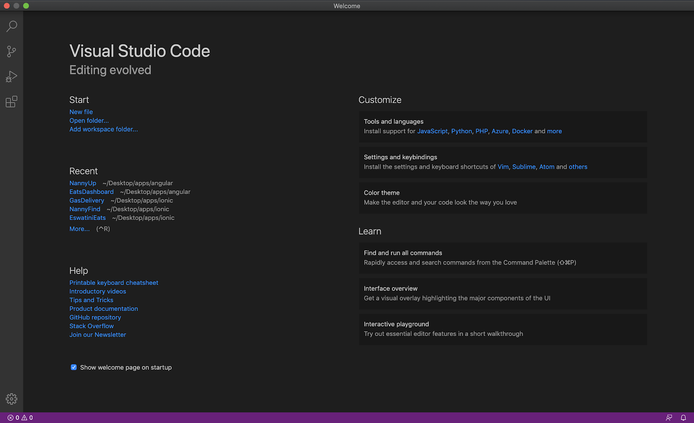
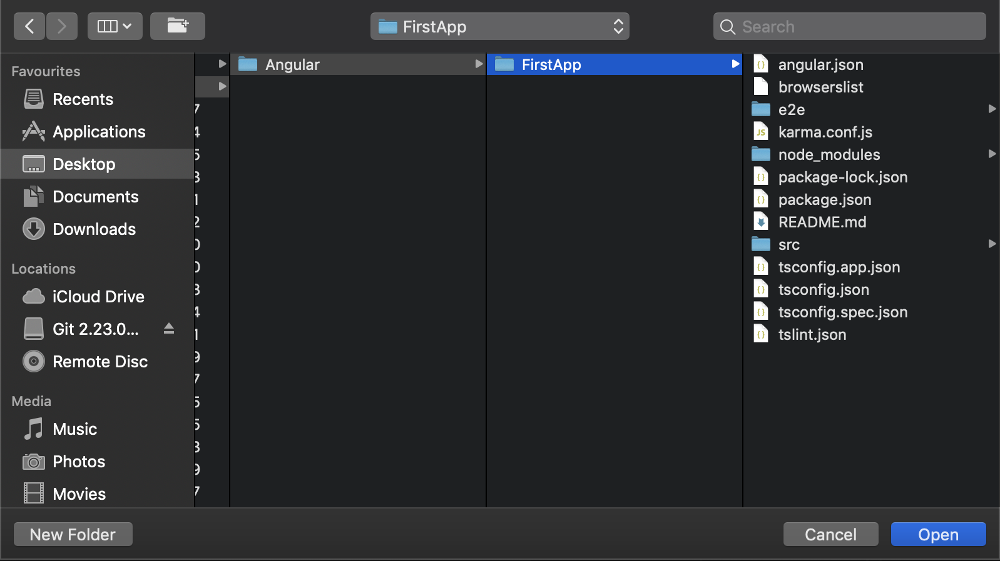

1. Create a folder on your desktop and call it CodeTribe. Inside the folder create another folder called Angular.
2. Open Your CMD(Command Prompt). If you are using Windows  10, navigate to your search bar then type CMD.. The black screen that pops up is your CMD. This is where we will initially create our applications.

**Should look something like this. This one's for mac.**

3. Now navigate to your Angular folder using the cd command.

Type **cd desktop** on your cmd then press enter. Type **cd CodeTribe** then press enter. 

Type **cd Angular** then press enter.

4. Now create an Angular Application called FirstApp

Accept Angular routing by type y (yes) then pressing enter. Angular Routing file that will be created will handle the Angular web application navigation.

Navigate down to SCSS. SCSS is just CSS on steroids. Therefore you will be able to use the knowledge you have on CSS to Script your css code. SCSS just gives the ability to just nest your CSS code. 

Allow the application to finish creation.

6. Navigate to FirstApp using cd(cd FirstApp).
7. Let us run the server using ng serve. Do not install angular analytics. Your server should be launched and be listening in on localhost:4200. Copy localhost:4200 onto your browser. Please note; never use explorer for development. Please download Opera mini and Google Chrome. We will work with Opera mini majority of the time throughout this document.

This is your first Angular application. Congratulations on taking your first step towards mastering angular development.

8. Now it is time for us to open our Angular Application on VS Code and start coding! You ready? 

If you open up VS code. You should see a screen like this one. Your one will have empty recent projects at the moment. 

1. Click on the **file** tab at the top left corner of VS Code. Click on open then navigate to FirstApp.

2. Click on open and you will be able to see the file structure below. If you expand the **src** folder you will be able to see the **app** folder. Majority of development will be done inside the **src** folder. This is the location where our **services** folder and **component** folder will be located.

