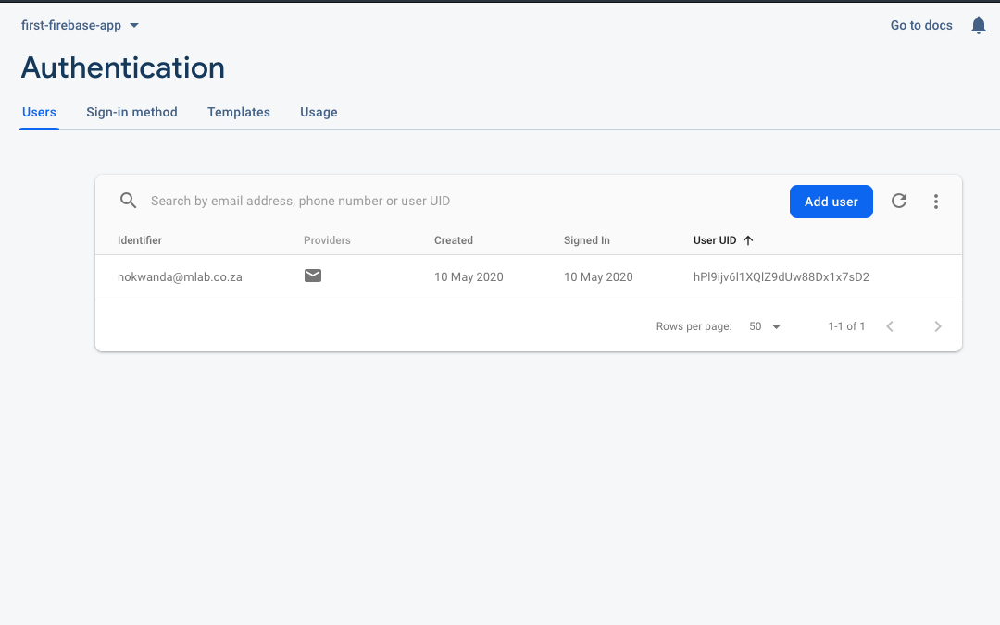

You need to first enable this sign-in method on your firebase console


* Under authentication select Sign-in-method, then enable email/password and also Google method.
* Remember if they are not enabled, you will not be able to use the firebase SDK for authentication.

In our book directory example, we are going to add login, register and forgot password pages to implement our authentication methods.

* Under Register Page

  * We will use - createUserWithEmailAndPassword which takes two parameters, new user’s email and password

  * ```javascript
    firebase.auth().createUserWithEmailAndPassword("nokwanda@mlab.co.za", "password").catch( (error) => {
         // Handle Errors here.
         var errorCode = error.code;
         var errorMessage = error.message;
         console.log(errorMessage);
       }).then( () =>{
         console.log("successfully Registered");
       });
    
    ```

    This method will create a user and store the credentials to the database:

    

* Under Login Page:

  * We will use signInWithEmailAndPassword - which also take two parameters, the registered user’s email and password:

  * ```javascript
     firebase.auth().signInWithEmailAndPassword("email@gmail.com", "password").catch((error) => {
         var errorCode = error.code;
         var errorMessage = error.message;
         console.log(errorMessage);
        
       }).then(() => {
         console.log("Successfully loggedIN");
       });
    
    ```

  * This will throw an error if the credentials are not stored on the database.

  * To sign user out use signOut :

  * ```javascript
    firebase.auth().signOut().then( () =>{
         console.log("User successfully signed out");
       }).catch( (error) =>{
         console.log(error.message);
       });
    
    ```

* Reset/forgot Password page

  * In case a user doesn't remember the password, use sendPasswordResetEmail which takes a parameter of a registered user then sends the reset link via the email to the user 

  * ```javascript
    firebase.auth().sendPasswordResetEmail("email@gmail.com").then(function() {
         console.log("Email sent");
       }).catch((error) =>{
         console.log(error.message);
       });
    
    ```

    

