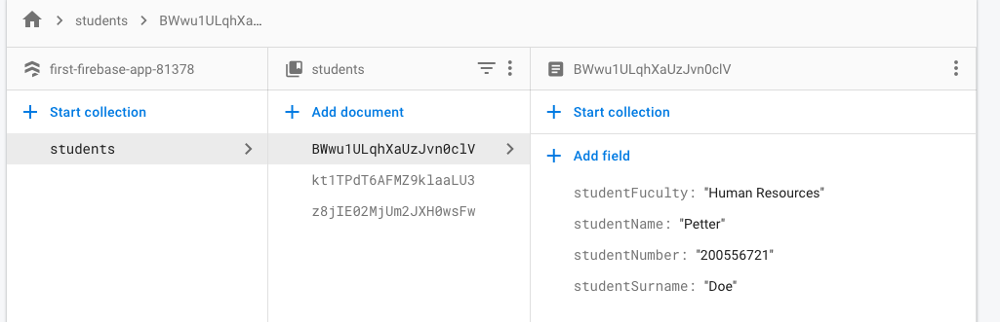

* Create a Student Register App and initialize it to a firebase 
* Have Students Page that shows a list of students register
* Have another page for entering new student 

* Student List page must have remove button to remove a student
* Save a student under ‘student’ collection on firestore 
* Save student name., surname, student number and faculty 

