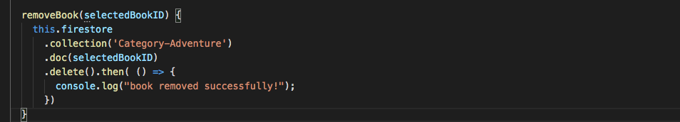

* Removing data from the database must be done carefully, in case of firestore you need to specify which document you want to remove. 
* In the case of a book record example app, we will need to specify which book entry we want t0 remove so we do not remove the entire collection of categories.
* Since now we have auto generated the doc ID we can specify the book ID from the firebase of the book entry we want to remove.

* Deleting method - from our HTML side the delete button will pass the specific ID for the book you want to delete.
* Use that book as a parameter of doc().
* The delete() will remove the record of the book in belonging to that book ID under the collection of category 

