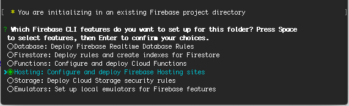

* On your terminal run command: firebase init
* Choose option Hosting: Configure and deploy Firebase Hosting sites

* Choose the project you created on your firebase that you want to host
* Then enter www on : “What do you want to use as your public directory”

* Type yes to rewrite all urls to /index.html

* Now build the app again using command: ionic build --prod