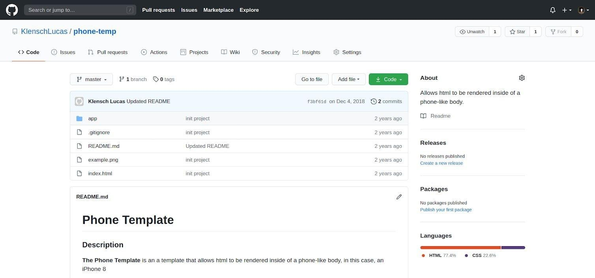
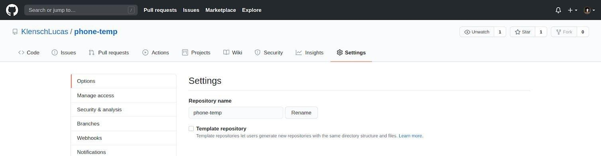
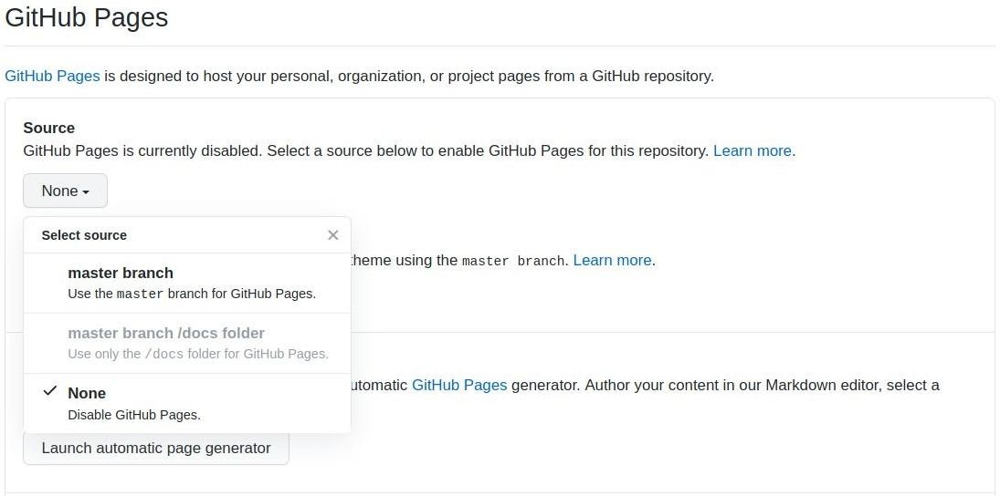
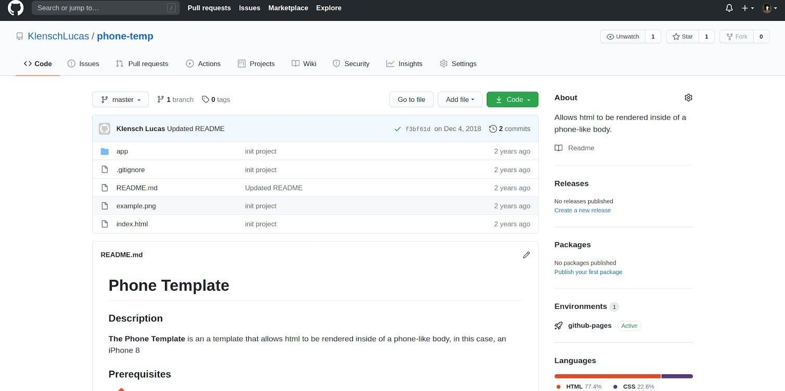

## Step 1

Make sure you have an index.html file in your github repository, such as below

## Step 2

Navigate to the Settings Tab on github

## Step 3

On the Settings page, scroll down to the section **Github Pages.** Then click on **Source** and select *master branch*

## Step 4

You should a blue popup on the top of the screen, saying "Github Pages sources saved"

You should also see on the homepage of the repository on the right of the screen under Packages, a section called Environments, github-pages. You can click on that.

## Step 5

You see your site by clicking View deployment

## Step 6

You can share that link with everyone to see your site and you're done!