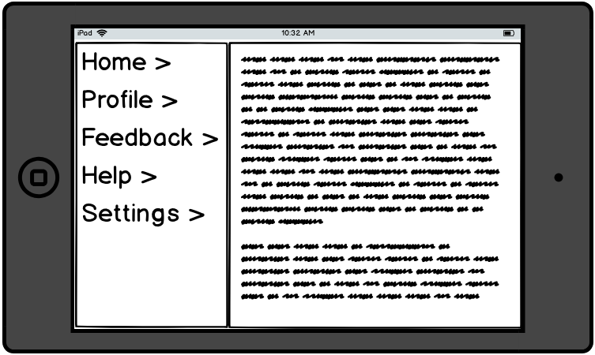
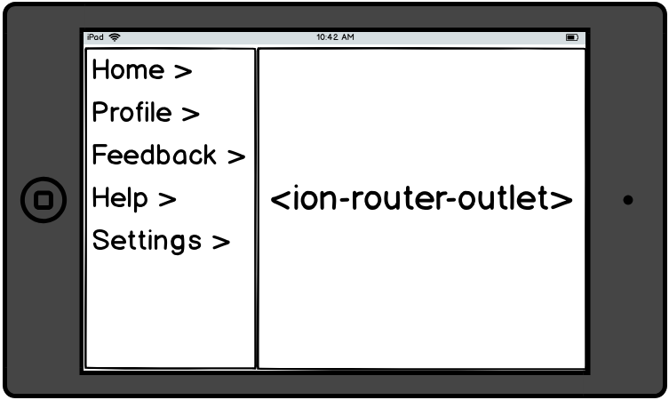
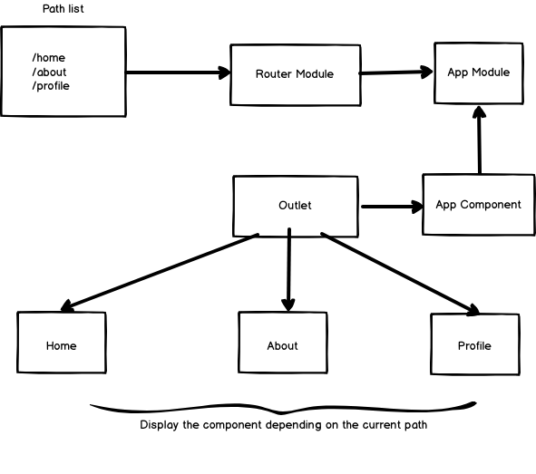

Throughout Ionic 2 until 3, there was no such thing as the Angular Router (unless you did something a little extra). Ionic used its own custom routing with NavController to control the flow of your Ionic App. NavController had methods like push, pop and setRoot. Push was used to display a page and add it to the stack. Pop would remove a page that has been added to the stack and setRoot will display a page while starting a new stack, meaning you cannot go back to the previous page.

With Ionic 4, the recommended way to navigate between pages is through the Angular Router (if you are using ionic with angular of course). The unfortunate part of this change is that it’s not as easy as pushing and popping pages. Fortunately, the angular router does come with some benefits, especially when you have plans use your app as a webapp as well.

###ANGULAR ROUTER

The Angular Router manages navigation in angular apps. Remember that angular apps are made up of components. The router is responsible of figuring out which component to display on the outlet based on the URL path the app is at. Below is an example of a master-detail layout



---
You have a menu on the left. Clicking on the menu item, changes the view on the right. For the view on the right to change based on the current path, it needs to have an outlet. The outlet checks the current path and displays the relevant component registered for that URL. All components you want to display in the outlet need to be registered in the route module



To see this in practical form, start a new blank Ionic 4 project. If you don’t already know how to do that – have a look at [creating an Ionic 4 app](https://www.ionicfire.com/installing-ionic/).

Within the **app** folder, you will see the files **app.component.html, app.component.ts, app-routing.module.ts and app.module.ts.** Below is an illustration of how they link up. The app.module.ts imports the Router Module and within the Router Module the list of paths are added. The App Component’s HTML file has the <ion-router-outlet> to load components based on the current path.



> This is an example of a master-detail setup. The code below is not a representation of the setup above.

app-routing.module.ts

```typescript
import { NgModule } from '@angular/core';
import { Routes, RouterModule } from '@angular/router';

const routes: Routes = [
  { path: '', redirectTo: 'home', pathMatch: 'full' },
  { path: 'home', loadChildren: './home/home.module#HomePageModule' },
];

@NgModule({
  imports: [RouterModule.forRoot(routes)],
  exports: [RouterModule]
})
export class AppRoutingModule { }
```

The array routes is the list of paths you want to register for your mobile app. In the example above, there are two paths. One is the default “/” path and the other is “/home”. Let’s go through the list of properties in the route object.

### path

This defines the path you want your user to navigate to. It’s a string and the path is relative.

### redirectTo

The **redirectTo** property describes the path we want to redirect this user to if they navigate to this URL.

### loadChildren

The **loadChildren** property describes the component you want to load when the user navigates to the path. This is a string with the path to your ionic page’s Module and then add a # then specify the page’s component. This is called Lazy Loading, Angular will only load the component when the user accesses it.

app.module.ts

```typescript
import { NgModule } from '@angular/core';
import { BrowserModule } from '@angular/platform-browser';
import { RouteReuseStrategy } from '@angular/router';

import { IonicModule, IonicRouteStrategy } from '@ionic/angular';
import { SplashScreen } from '@ionic-native/splash-screen/ngx';
import { StatusBar } from '@ionic-native/status-bar/ngx';

import { AppComponent } from './app.component';
import { AppRoutingModule } from './app-routing.module';

@NgModule({
  declarations: [AppComponent],
  entryComponents: [],
  imports: [BrowserModule, IonicModule.forRoot(), AppRoutingModule],
  providers: [
    StatusBar,
    SplashScreen,
    { provide: RouteReuseStrategy, useClass: IonicRouteStrategy }
  ],
  bootstrap: [AppComponent]
})
export class AppModule {}
```

AppRoutingModule is imported in AppModule

app.component.html

```html
<ion-app>
  <ion-router-outlet></ion-router-outlet>
</ion-app>
```

And finally the **ion-router-outlet** is loaded inside **app.component.html**

## Navigating

Now that you have everything setup, time to learn how to navigate to different pages. First create an about page

```
$ ionic g page about
```

You will see inside your app-routing.module.ts that the route has already been added for you to the path /about. That’s one for the benefits of using Ionic’s CLI, it does the boiler-plating for you.

Remove the default HTML within the **<ion-content>** of your **home.page.html** and add a button and give it a click event that calls the method **navigate**.

```html
<ion-header>
  <ion-toolbar>
    <ion-title>
      Home
    </ion-title>
  </ion-toolbar>
</ion-header>

<ion-content padding>
  <ion-button color="primary" (click)="navigate()">Navigate to About</ion-button>
</ion-content>
```

Inside your TypeScript file, import the Router and inject it into your constructor. The create a method navigate to navigate to about.

```typescript
import { Component } from '@angular/core';
import { Router } from '@angular/router';

@Component({
  selector: 'app-home',
  templateUrl: 'home.page.html',
  styleUrls: ['home.page.scss'],
})
export class HomePage {

  constructor(private router: Router) {

  }

  navigate() {
    this.router.navigate(['about'])
  }
}
```

Run your project, clicking the button will navigate to the about page. Let me further explain how router.navigate works. As you can see, it receives an array of strings. Each string represent the hierarchy of the path. For instance, [‘about’] represents /about and [‘about’, ‘donate’] represents the path /about/donate.

## Passing values over

In many cases, you may want to carry a variable from one page to the next when navigating. You can simply do this by modifying the route of the page you want to go to to accept parameters. Edit your about page route in app-routing.module.ts

```typescript
{ path: 'about/:message', loadChildren: './about/about.module#AboutPageModule' }
```

So the path now is about/:message. In this case, message is the name of the parameter we are passing through. Modify your **navigate()** method from your HomePage to include the parameter.



```typescript
navigate() {
	this.router.navigate(['about', 'Hello World'])
}
```

**Hello World** is the parameter we are sending over to **About Page**. Next we need to intercept the parameter using ActivatedRoute in **About Page**

```typescript
import { Component, OnInit } from '@angular/core';
import { ActivatedRoute } from '@angular/router';

@Component({
  selector: 'app-about',
  templateUrl: './about.page.html',
  styleUrls: ['./about.page.scss'],
})
export class AboutPage implements OnInit {
  message

  constructor(private route: ActivatedRoute) { }

  ngOnInit() {
    this.route.params.subscribe(params => {
      this.message = params['message']
    })
  }

}
```

You can send through multiple parameters, you just have to register them beforehand in your route. For example, to send **name** and **message** parameters, your route would look like this

```typescript
{ path: 'about/:message/:name', loadChildren: './about/about.module#AboutPageModule' }
```

For the navigation part

```typescript
navigate() {
	this.router.navigate(['about', 'Hello World', 'John Doe'])
}
```

## Alternative way of navigating

Angular is full of diverse ways of achieving certain tasks, navigating is not an exception. If you don’t want to go through the whole effort of injecting the router into the constructor and creating a method for the click event, you can use the routerLink property.

Modify your <ion-button> by removing the click event and replace it with the routerLink

```html
<ion-button color="primary" [routerLink]="['about', 'Hello World']">Navigate to About</ion-button>
```

This will give you the same result. You can also have it like this

```html
<ion-button color="primary" routerLink="/about/Hello World">Navigate to About</ion-button>
```

It’s up to you which method you want to use. If you are unclear on something, don’t hesitate to leave a comment. I’ll try my best to answer your questions. Remember to [subscribe](https://www.ionicfire.com/sign-up/) to receive more articles like these into your mailbox. Thanks for reading.