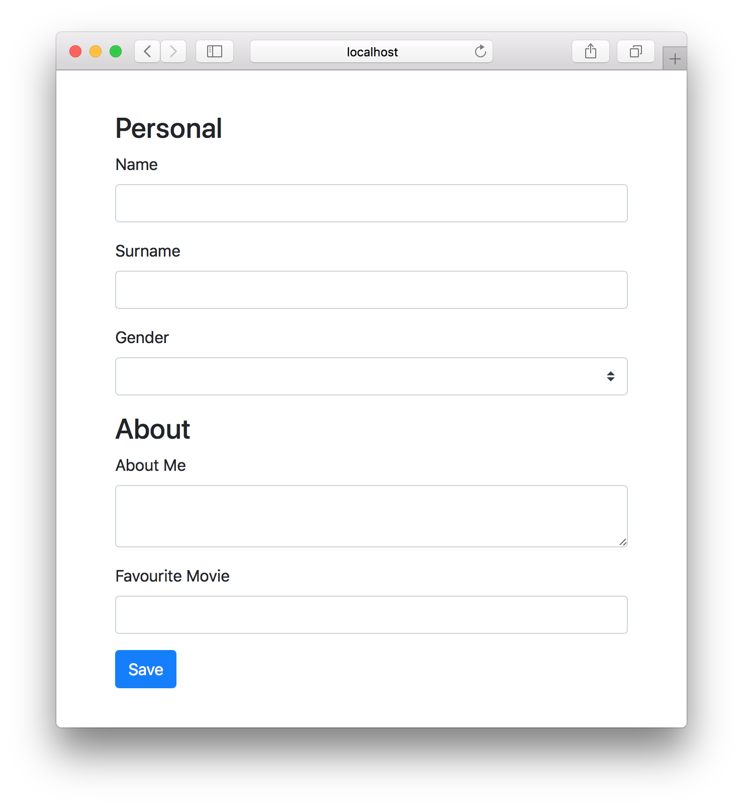

## The Importance of Forms

Forms are an important aspect of almost all applications. They are the bridge between the users and us, the coders. This is because they are the most commonly used way to receive input from users. The other ways are of-course audio, gestures etc. Because of the high value of importance they have, we have to take every step necessary to make sure the experience we give our users is noteworthy. Luckily for us, Angular has provided ways to make us (the developers) work with forms quick and easy. We do this by using what is know as Angular Template Forms.

## Using Angular Template Forms

In this article I will demonstrate how to use Angular Forms to receive model-formatted input from your users. As an example, we will build an app that retrieves profile information for a dating site. To add a little pazzazz and make our app pretty, we will use bootstrap. Add bootstrap to your app by adding this line in your **src/styles.css**

```css
@import url('https://unpkg.com/bootstrap@3.3.7/dist/css/bootstrap.min.css');
```

> Please note that adding bootstrap is **optional** and will not affect the functionality of Angular Forms. This is strictly for aesthetics. Therefore you can use any front-end framework you heart desires.

## Create a normal HTML Form

We want to get the following information from our user

**Personal**

- Name
- Surname
- Gender

**About**

- About me
- Favourite movie

Our HTML looks like this

```html
<div class="container" style="margin-top: 40px">
  <form>
    <h3>Personal</h3>
    <div class="form-group">
      <label for="name">Name</label>
      <input class="form-control" type="text" />
    </div>
    <div class="form-group">
      <label for="surname">Surname</label>
      <input class="form-control" type="text" />
    </div>
    <div class="form-group">
        <label for="gender">Gender</label>
      <select class="custom-select">
        <option value=""></option>
        <option value="male">Male</option>
        <option value="female">Female</option>
        <option value="other">Other</option>
      </select>
    </div>

    <h3>About</h3>
    <div class="form-group">
      <label for="about">About Me</label>
      <textarea class="form-control" type="text" ></textarea>
    </div>
    <div class="form-group">
      <label for="movie">Favourite Movie</label>
      <input class="form-control" type="text" />
    </div>
    <button class="btn btn-primary">Save</button>
  </form>
</div>
```



## Integrating with Angular Template Forms

There is nothing special here, just plain old HTML. We are not using any Angular yet. What we want to do is capture the values of the form and submit that to what ever server we have. Before submitting to the server, we also want to validate the information entered. Let’s get right on it then. First thing’s first, before using Angular Template Forms, you need to import the **FormsModule** to your **AppModule**.

```typescript
...
imports: [
    BrowserModule,
    FormsModule
],
...
```

Once that’s done, we can start making our form template driven. Let’s first declare a template variable that references an Angular Form (ngForm) by updating your **<form>** tag to this **<form #myForm=”ngForm”>**. We also want to handle the event when the **save**button is pressed. Add an (ngSubmit) event handler to the form as well to register to a method called **submit()**. Your form tag should look like this

```html
<form #myForm="ngForm" (ngSubmit)="submit(myForm)">
```

We don’t have a submit method defined in our **app.component.ts**. Add one with the following code. All it does is output the value of our form to the console.

```typescript
submit(form: FormGroup) {
  console.log(JSON.stringify(form.value))
}
```

Test your app, fill in the form and submit. Now check your console, you will see that the only output is this

```json
{}
```

Obviously something is wrong since this does not help us at all. You need to tell the form somehow what values you are looking for in the form and what keys should be used to label them. We achieve this by defining a **name** attribute to each input field, as well as placing the **ngModel** directive on each field as well. This is the final result of the **app.component.html**

```html
<div class="container" style="margin-top: 40px">
  <form #myForm="ngForm" (ngSubmit)="submit(myForm)">
    <h3>Personal</h3>
    <div class="form-group">
      <label for="name">Name</label>
      <input class="form-control" type="text" ngModel name="name" />
    </div>
    <div class="form-group">
      <label for="surname">Surname</label>
      <input class="form-control" type="text" ngModel name="surname" />
    </div>
    <div class="form-group">
        <label for="gender">Gender</label>
      <select class="custom-select" ngModel name="gender">
        <option value=""></option>
        <option value="male">Male</option>
        <option value="female">Female</option>
        <option value="other">Other</option>
      </select>
    </div>

    <h3>About</h3>
    <div class="form-group">
      <label for="about">About Me</label>
      <textarea class="form-control" type="text" ngModel name="about"></textarea>
    </div>
    <div class="form-group">
      <label for="movie">Favourite Movie</label>
      <input class="form-control" type="text" ngModel name="movie"/>
    </div>
    <button class="btn btn-primary">Save</button>
  </form>
</div>
```

Test the app now, and you should see something similar to this (obviously with what you filled in).

```json
{  
   "name":"Melvin",
   "surname":"Musehani",
   "gender":"male",
   "about":"I love writing about Angular",
   "movie":"Tron Legacy"
}
```

## Group user input

The information we are asking for belongs in two different groups. One is personal, the other is the about. Let’s say you want to divide that information in the data format as well. To create these sub-groups, you will need to enclose your form fields with a tag (in our case we will use a **<div>**) with a directive **ngModelGroup** taking the name of the group. Here’s an example

```html
<div class="container" style="margin-top: 40px">
  <form #myForm="ngForm" (ngSubmit)="submit(myForm)">
    <div ngModelGroup="personal">
    <h3>Personal</h3>
    <div class="form-group">
      <label for="name">Name</label>
      <input class="form-control" type="text" ngModel name="name" />
    </div>
    <div class="form-group">
      <label for="surname">Surname</label>
      <input class="form-control" type="text" ngModel name="surname" />
    </div>
    <div class="form-group">
        <label for="gender">Gender</label>
      <select class="custom-select" ngModel name="gender">
        <option value=""></option>
        <option value="male">Male</option>
        <option value="female">Female</option>
        <option value="other">Other</option>
      </select>
    </div>
  </div>

  <div ngModelGroup="about">
    <h3>About</h3>
    <div class="form-group">
      <label for="about">About Me</label>
      <textarea class="form-control" type="text" ngModel name="about"></textarea>
    </div>
    <div class="form-group">
      <label for="movie">Favourite Movie</label>
      <input class="form-control" type="text" ngModel name="movie"/>
    </div>
  </div>
    <button class="btn btn-primary">Save</button>
  </form>
</div>
```

Now our data looks like this

```json
{  
   "personal":{  
      "name":"Melvin",
      "surname":"Musehani",
      "gender":"male"
   },
   "about":{  
      "about":"I love writing about Angular",
      "movie":"Tron Legacy"
   }
}
```

## That’s a wrap

As simple as that, we are able to collect data from our form and format it in JSON within sub-groups. Now you can use that information and do whatever you want with it (most likely post it to a server). I hope you enjoyed this tutorial. If anything was unclear, don’t hesitate to ask in the comments section below. Share with your circle if you found this useful. Remember to subscribe to receive weekly newsletters on what’s new and happening in the world of Ionic, Angular and Firebase.