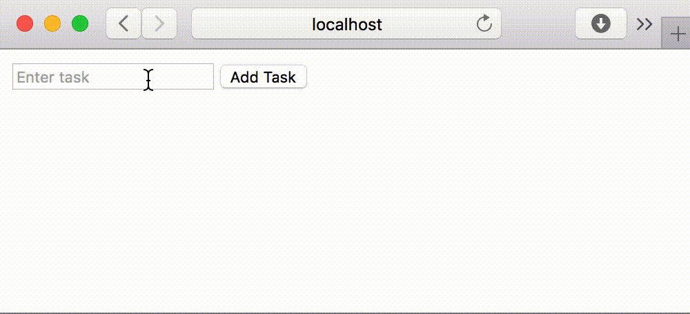
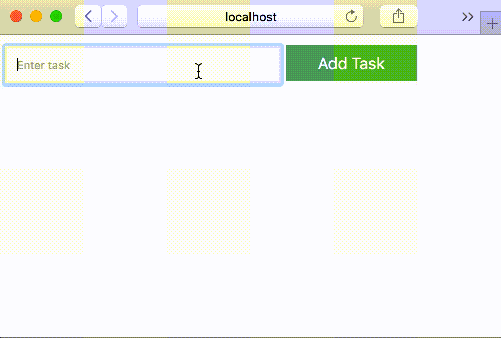

In almost every app, there is a need to change content on the HTML dynamically or receive some input from the user and then apply a change to the UI. Angular data binding gives you the tools to achieve just that – and the best part is that it’s super simple and convenient.

In this tutorial, you will learn how to bind data from your TypeScript file to your HTML file. You may be wondering what I mean by binding. I simply mean passing data to and from your TypeScript and HTML file.

To demonstrate that, let’s create a simple task list that takes in user input from an input field and at the same time interprets what you typed into a header tag (**h3**). Once you click on a button to submit, it will append the item into a list. Below is an example of what you should expect after this tutorial.



Start off by starting a new project named **task-list**

```shell
ng new task-list --open
```

We’ll start by editing the app.component.html. Paste the code below

```html
<input type="text" placeholder="Enter task" [(ngModel)]="task" /><button (click)="addTask()">Add Task</button>
<h3>{{task}}</h3>

<ol>
  <li *ngFor="let item of tasks">{{item}}</li>
</ol>
```

Most of this is basic HTML code although we have some Angular syntax going on here. Let me explain:

### Two-Way Binding

The code [(ngModel)] is used to bind the variable “task” in the TypeScript file to the input. This is known as **Two-Way Binding** – meaning that the value of the input will be initially loaded with the value of the variable “task” and the variable “task” will be automatically set to any input that’s inputed.

### One-Way Binding

**One-Way binding** is almost the same as Two-Way binding with a difference of the variable is sent over to the HTML and the HTML side cannot change it. Maybe we can call it read-only binding since data cannot be changed. However, whenever the variable is changed on the TypeScript side, it will also change on the HTML side. This is useful when displaying information, and updating it whenever something happens (like a new chat message received). Here’s a snippet of One-way data binding from the code above:

```html
<h3>{{task}}</h3>
```

This assigns the variable “**task**” to the **h3** tags. As **“task”** is changed, the h3 tag’s value will change as well. We use double curly-brackets to One-Way Binding.

To use One-Way binding on an input, you will just remove the round-brackets from the **ngModel**. It will look like this

```html
<input type="text" placeholder="Enter task" [ngModel]="task" />
```

When using only the square-brackets, inputing a value into the input will not change the value of the variable in the “**task**” but if you set an initial value to “**task**” in the TypeScript file, you will see that the input will initially take that value. You can try it out.

```typescript
task = 'Initial Value Here'
```

### Listing

Our app requires a list to be displayed as the user adds a new task. In our TypeScript file we’ll create an array called “tasks” and a method called “**addTask()**” which will be called every time a user clicks on the “Add Task” button. All we’ll do in the function is push the value of the “**task**” variable into the “**tasks**” array and then clear the variable by assigning it to a blank string.

```typescript
import { Component } from '@angular/core';

@Component({
  selector: 'app-root',
  templateUrl: './app.component.html',
  styleUrls: ['./app.component.css']
})
export class AppComponent {
  task = '';
  tasks = []

  addTask() {
    this.tasks.push(this.task)
    this.task = ''
  }
}
```

Then how do we list the “tasks” array in the HTML? Well by using an ***ngFor** directive. A directive is an attribute to an HTML element that gives that element a certain behaviour. Angular comes with a few built in directives and we’ve already used one above called “**ngModel**“. *ngFor is another directive, and what it does is duplicate a section of HTML that you put between the opening and closing tag of the element that has the ***ngFor.** Taking from our example above you will see that we used it as presented below

```html
<li *ngFor="let item of tasks">{{item}}</li>
```

This will create multiple <li> tags by looping through tasks. Each <li> will have a variable **“item”** representing the local variable in the loop. In our case, it’s the task name.

### Events

Now that we have data binding and listing all covered up, let’s talk more about the events. Without events, our apps will not be able to interact with our users – thus making events an important part of every app. Fortunately they are simple – like most things in Angular.

```html
<button (click)="addTask()">Add Task</button>
```

As you might have already guessed, we use round-brackets to assign events to methods in your TypeScript. Here we are assigning the (click) event to the **“addTask()”** method found in your TypeScript. Easy as that.

```typescript
addTask() {
    this.tasks.push(this.task)
    this.task = ''
}
```

You should have a working task manager, but not a very good looking one. Let’s change that by adding some styling to spice things up. Add the css below to your app.component.css

```css
input {
    border-style: solid;
    border-width: 1;
    border-color: #efefef;
    background: white;
    padding: 10px;
    color: black;
    width: 250px;
}

button {
    background-color: #4CAF50; /* Green */
    border: none;
    color: white;
    padding: 9px 32px;
    text-align: center;
    text-decoration: none;
    display: inline-block;
    font-size: 16px;
    margin-left: 5px;
}

h3 {
    font-weight: 100;
    color: #c0c0c0;
}

ol {
    list-style-type: none;
    margin: 0;
    padding: 0;
  }
   
  li {
    font: 200 20px/1.5 Helvetica, Verdana, sans-serif;
    border-bottom: 1px solid #ccc;
    cursor: pointer;
  }
   
  li:last-child {
    border: none;
  }

  li:hover {
    font-size: 30px;
    background: #f6f6f6;
  }
```

I will not be explaining the CSS above since it’s beyond the scope of this tutorial. If you’d like to learn CSS, [W3Schools](https://www.w3schools.com/) have a lot of tutorials to help you with that. The end result should look like this



That about wraps up this tutorial. If you have any questions or stuck, please don’t hesitate to ask in the comments section. Obviously there’s much more you can do with what you have learned. Perhaps for this particular app, you can challenge yourself by adding a click event to each list item that deletes the task from the list when clicked. Tell me how that goes. Good luck!

