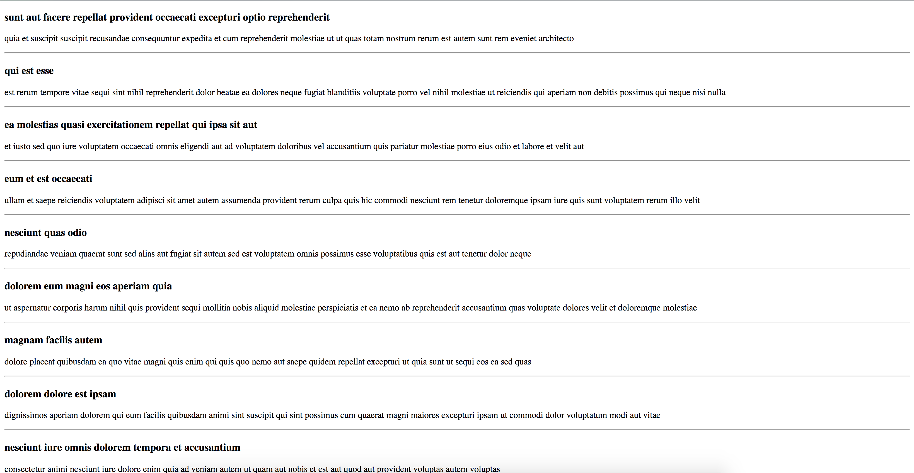
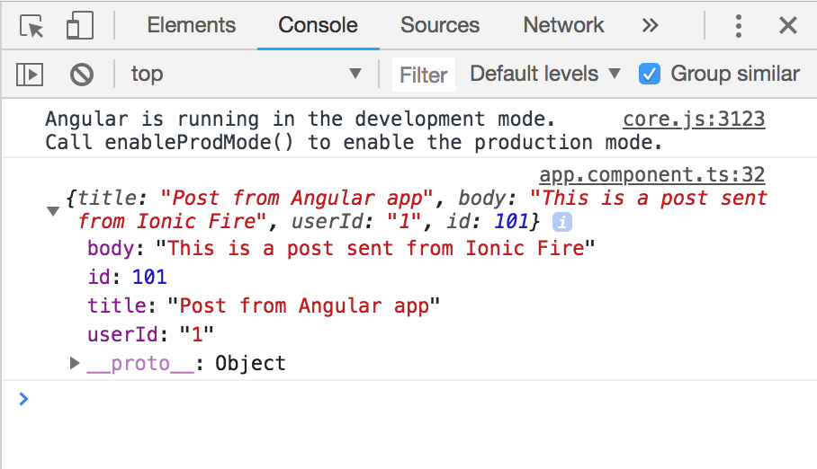

Building offline apps is all fun and great, but there are instances where you need to access external information. Actually, the majority of apps and web applications out there access external data. Whether it’s for authenticating users, getting the latest scores of the tournament or getting an updated news feed – all of these are possible with RESTful APIs. In this article, you will learn how to consume HTTP APIs in Angular.

## What is RESTful APIs

**REST** stands for **RE**presentational **S**tate **T**ransfer. It is an architectural standard for communication between client and server. The implementation allows the client and the server to be independent and stateless. Independent in a sense that code changes done on the client do not affect the server and vice-versa. When a system is stateless, it means the server does not need to know in which state the client is in, and the client likewise does not need to know the state of the server. A system that is REST complaint is known as RESTful.

## Communication between client and server

In a RESTful system, the client needs to tell the server to do one of four things.

- Retrieve Content
- Add content
- Edit Content
- Remove Content

Those are done by requesting using the HTTP verbs below

- GET (Retrieve content)
- POST (Add content)
- PUT (Edit content)
- DELETE (Remove content)

There are many other verbs, but they are not important for this article at the moment. If you want to learn more about them, you can have a look at this wiki about [Hypertext Transfer Protocol](https://en.wikipedia.org/wiki/Hypertext_Transfer_Protocol).

Let’s get right into building an HTTP compatible Angular app. Our application is simple.

- We will **GET** a list of posts
- **POST** a new post to our list
- Update an existing post using **PUT**
- **DELETE** a post

We will use [https://jsonplaceholder.typicode.com](https://jsonplaceholder.typicode.com/) for our API. They provide a dummy API we can play around with for testing purposes. Our API calls will look like this:

- GET – /posts
- POST – /posts
- PUT – /posts/{id}
- DELETE – /posts/{id}

A reply from the GET /posts resource looks like this

```json
[
  {
    "userId": 1,
    "id": 1,
    "title": "sunt aut facere repellat provident occaecati excepturi optio reprehenderit",
    "body": "quia et suscipit\nsuscipit recusandae consequuntur expedita et cum\nreprehenderit molestiae ut ut quas totam\nnostrum rerum est autem sunt rem eveniet architecto"
  },
  {
    "userId": 1,
    "id": 2,
    "title": "qui est esse",
    "body": "est rerum tempore vitae\nsequi sint nihil reprehenderit dolor beatae ea dolores neque\nfugiat blanditiis voluptate porro vel nihil molestiae ut reiciendis\nqui aperiam non debitis possimus qui neque nisi nulla"
  }...
]
```

> Remember, these are the API rules for this API. Other APIs may have different rules as there is no API standard out there

## Putting it into code

Start a new Angular Project and head into your **“app.module.ts”** file. Before working with HTTP, you need to import the Angular HTTP module. Import **“HttpModule”** from **“@angular/router”** and append the **“imports”** array with **“HttpModule”**.

```typescript
import { BrowserModule } from '@angular/platform-browser';
import { NgModule } from '@angular/core';

import { AppComponent } from './app.component';
import { HttpModule } from '@angular/http'

@NgModule({
  declarations: [
    AppComponent
  ],
  imports: [
    BrowserModule,
    HttpModule
  ],
  providers: [],
  bootstrap: [AppComponent]
})
export class AppModule { }
```

Now you are ready to do some REST requests. Create a service called **posts** inside the directory **services**.

```shell
ng g service services/posts
```

Remember, every time you add a **service**– you need to append that **service** to your **providers** array in your **app.module.ts** file. In our case, append **PostsService** to the **providers** array. Add the code below in your **posts.service.ts** file

```typescript
import { Injectable } from '@angular/core';
import { Http } from '@angular/http';

@Injectable({
  providedIn: 'root'
})
export class PostsService {
  private host = 'https://jsonplaceholder.typicode.com'

  constructor(private http: Http) { }

  posts() {
    return this.http.get(this.host + '/posts');
  }

  add(article: Article) {
    return this.http.post(this.host + '/posts', article);
  }

  update(id, article: Article) {
    return this.http.put(this.host + '/posts/' + id, article)
  }

  remove(id) {
    return this.http.delete(this.host + '/posts/' + id)
  }
}

export interface Article {
  id: string
  userId: string
  title: string
  body: string
}
```

As you can see, there are four methods created – each calling the specific HTTP verb required task to be accomplished. We also have a global **host** variable that houses the link to the API. Our interface **Article** is there to protect us from sending the wrong **post** format for our **update** and **add** methods. All the methods return an Observable which you need to subscribe to view the results.

> Even though we are using a global variable in our example above. It’s only accessible within the **PostsService** class. It will even be better to have a separate values file and export the API link to be accessible globally throughout the project. Making it possible for multiple services to use the same service. This will save you lots of time when API endpoints change.

## Testing our Service

It’s time to test our service. Go to your app.component.ts file, import PostsService and inject it into your constructor. Afterwards, call the PostsService.posts() method and output the result onto your console.

```typescript
import { Component } from '@angular/core';
import { PostsService } from './services/posts.service';

@Component({
  selector: 'app-root',
  templateUrl: './app.component.html',
  styleUrls: ['./app.component.css']
})
export class AppComponent {
  title = 'http';

  constructor(private postsSerivce: PostsService) {
    this.postsSerivce.posts().subscribe(posts => {
      console.log(posts)
    })
  }
}
```

The output you should get looks like this.


As you can see, something is not right here. We are expecting a JSON response, and we received this. The problem is, an HTTP request returns a lot of data such as headers, request status etc. All we are looking for at the moment is the body.

## Getting JSON data with HTTP GET

Let’s modify our service to do just that by adding a helper method called toJson().

```typescript
import { Injectable } from '@angular/core';
import { Http, Response } from '@angular/http';
import {map} from 'rxjs/operators'
import { Observable } from 'rxjs';

@Injectable({
  providedIn: 'root'
})
export class PostsService {
  private host = 'https://jsonplaceholder.typicode.com'

  constructor(private http: Http) { }

  toJson(observable: Observable<Response>) {
    return observable.pipe(map(response => response.json()))
  }

  posts() {
    return this.toJson(this.http.get(this.host + '/posts'))
  }

  add(article: Article) {
    return this.toJson(this.http.post(this.host + '/posts', article))
  }

  update(id, article: Article) {
    return this.toJson(this.http.put(this.host + '/posts/' + id, article))
  }

  remove(id) {
    return this.toJson(this.http.delete(this.host + '/posts/' + id))
  }
}

export class Article {
  id: string
  userId: string
  title: string
  body: string
}
```

All our methods are wrapped around the toJson() method. What does it do you may ask. It **maps** the results to a method **response.json()** which returns the JSON format of the response (This method assumes the response body will be JSON). Now our response looks like this.


You can now list the posts using basic angular directives

```typescript
// app.component.ts
import { Component } from '@angular/core';
import { PostsService } from './services/posts.service';

@Component({
  selector: 'app-root',
  templateUrl: './app.component.html',
  styleUrls: ['./app.component.css']
})
export class AppComponent {
  posts

  constructor(private postsSerivce: PostsService) {
    this.posts = this.postsSerivce.posts()
  }
}
```

```html
<!-- app.component.html -->

<div *ngFor="let post of posts | async" style="margin-bottom: 20px;">
  <h3>{{post.title}}</h3>
  <p>{{post.body}}</p>
  <hr />
</div>
```

Our output looks like this



## Adding content with HTTP POST

So far we have mastered retrieving data from an API. Let’s start posting data to the API using HTTP Post. We have already created our service with all the necessary methods, including a method to POST data. Let’s create a form that accepts a post title and description, with a button that will send the data to the API via POST.

Add a form above our list of posts (cosmetics are not really our focus here).

```html
<form [formGroup]="form" (ngSubmit)="submit()">
  <input placeholder="Title" type="text" formControlName="title" />
  <textarea placeholder="Body" type="text" formControlName="body"></textarea>
  <button>Post</button>
</form>
```

> If the code above is not making any sense at all to you, please have a look at the Angular Forms tutorial

```typescript
submit() {
    let value = this.form.value
    let article: Article = {
      title: value.title,
      body: value.body,
      userId: '1' // hardcoded user ID
    }

    this.postsSerivce.add(article).subscribe(result => {
      console.log(result)
    })
  }
```

Finally the submit method compiles our Article object with the entered values (as well as a hardcoded user ID) and calls PostsService.add() to fulfil the POST request. For testing purposes, we are using console.log to see the results.



## HTTP Headers

If needed, HTTP headers can be easily placed by adding the httpOptions variable to our calls. Here’s an example for both GET and POST.

```typescript
import { HttpHeaders } from '@angular/common/http';

const httpOptions = {
  headers: new HttpHeaders({
    'Content-Type':  'application/json',
    'Authorization': 'example-auth-token'
  })
};
```

```typescript
this.http.get(this.host + '/posts', httpOptions)
```

```typescript
this.http.post(this.host + '/posts', body, httpOptions)
```

I hope with this you can go and build exciting webapps that consume HTTP APIs. We didn’t implement the **update** and **delete** post UI, maybe you can give that a try to test out your new knowledge. Please tell us in the comment section of the exciting apps you have built using Angular and HTTP. If anything is unclear, or something is not working – please also leave that in the comment section. That’s it for now, remember to subscribe to our [newsletter](https://www.ionicfire.com/sign-up/) to receive the latest updates and how-tos regarding Ionic and Angular apps development. Thank you for taking your time to read this and I hope you enjoyed it. Happy Coding!