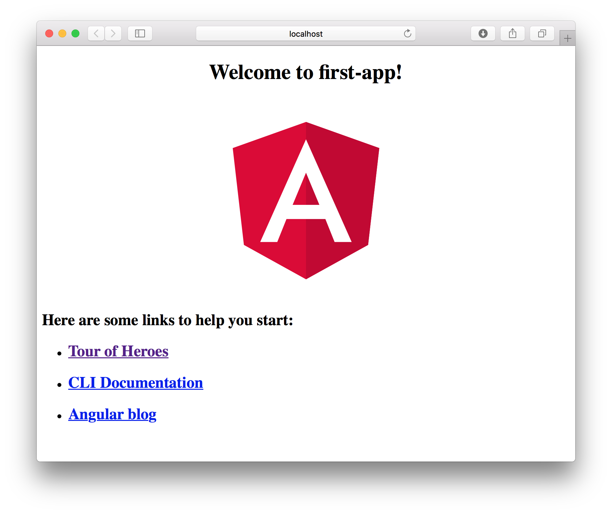
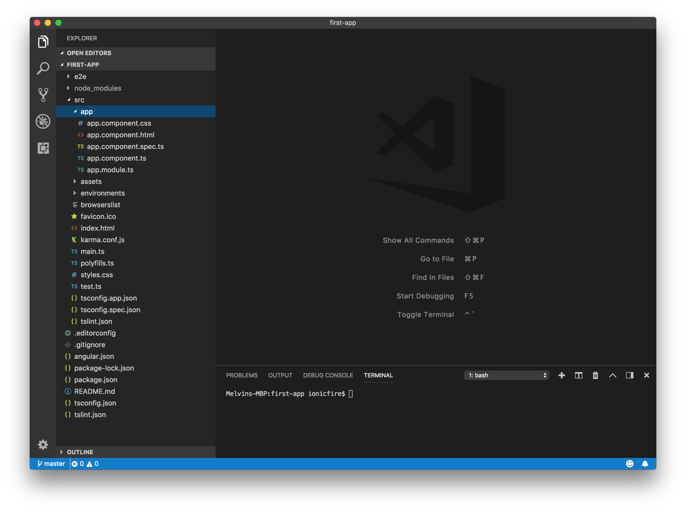

## What is Angular

Angular is a framework that makes building web apps a breeze. It does this by providing you with the tools to bind data to your HTML elements as well as handling your DOM events in an impressively neat way. The coolest part of Angular is its component feature which allows you to create and reuse components. We shall dwell in all of these features and many more later. Finally, you will also need to learn Angular before tackling [Ionic4](https://www.ionicfire.com/tutorials/). For now let’s get our hands dirty and install Angular.

## Install Angular CLI

Angular CLI is required to create/start Angular projects as well as scaffolding some of the features of the framework. So we’ll be installing this useful tool first. Before we start, you need to have **Node.JS 8.x** or higher and **npm version 5.x** or higher installed. Install Node.JS and npm if they are not already installed on your workstation.

When all is set, run the following command on your terminal

```shell
npm install -g @angular/cli
```

Once that’s done you can create your new Angular Project by running the following command

```shell
ng new first-app
```

If everything worked out well, a folder named “first-app” will be created. What’s left to do now is to run your newly created project

```shell
cd first-app
ng serve --open
```



The first line changes the directory and navigates into the “first-app” directory. “ng serve” tells angular to build and run the project in development mode and the extra –open will open the browser to the address your app is running on (usually [http://localhost:3000](http://localhost:3000/)). Congratulations, you have created your first Angular App.

## Understanding the Project Structure

Open the project folder in your favourite text editor to see the files and folders that were created (I use Visual Code). I will go through the folders and files useful for this tutorial, to understand more about the other files you can read about them on the official Angular Website.



### AppComponent 

```shell
src/app/app.component.ts
```

This is the main component of your project, at the moment it has the code to display what you saw when you ran your project in the browser. Business logic goes into this file, styling goes into it’s sibling .css file and formatting goes inside the .html file. You will learn more about components in further tutorials.

```typescript
import { Component } from '@angular/core';

@Component({
  selector: 'app-root',
  templateUrl: './app.component.html',
  styleUrls: ['./app.component.css']
})
export class AppComponent {
  title = 'first-app';
}
```

### AppModule

```
src/app/app.module.ts
```

Angular projects are modularised, meaning you can separate different features into modules making it possible for Angular to load only what’s needed. AppModule is the top level module and you can add project wide modules into this file

```typescript
import { BrowserModule } from '@angular/platform-browser';
import { NgModule } from '@angular/core';

import { AppComponent } from './app.component';

@NgModule({
  declarations: [
    AppComponent
  ],
  imports: [
    BrowserModule
  ],
  providers: [],
  bootstrap: [AppComponent]
})
export class AppModule { }
```

### Assets

```
src/assets
```

This is where you put images or any other static downloadable file you want to include when you build.

### Global Styles

```
src/styles.css
```

Even though each component in Angular has a CSS file for that component, styles.css is the global styles file. Any style placed here will reflect across all your components.

### Index File

What is an web app without an index.html file? This is a standard HTML file that includes <app-root> into the body tags (app-root is the name of the selector of AppComponent).

Now that you know the basic structure of an Angular app, you can head on and start making you app interactive by checking out the [Events and Data-binding tutorial](https://www.ionicfire.com/events-and-data-binding/).