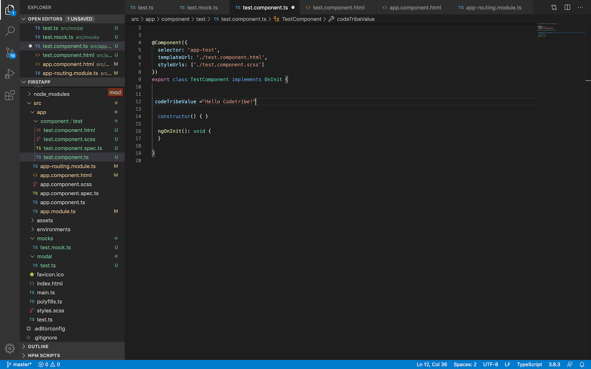

Two way data binding allows you to be able to represent data from the typescript to the html page and vice versa. It is represented using {{}} braces. You would then place your declared variable in between for example;

