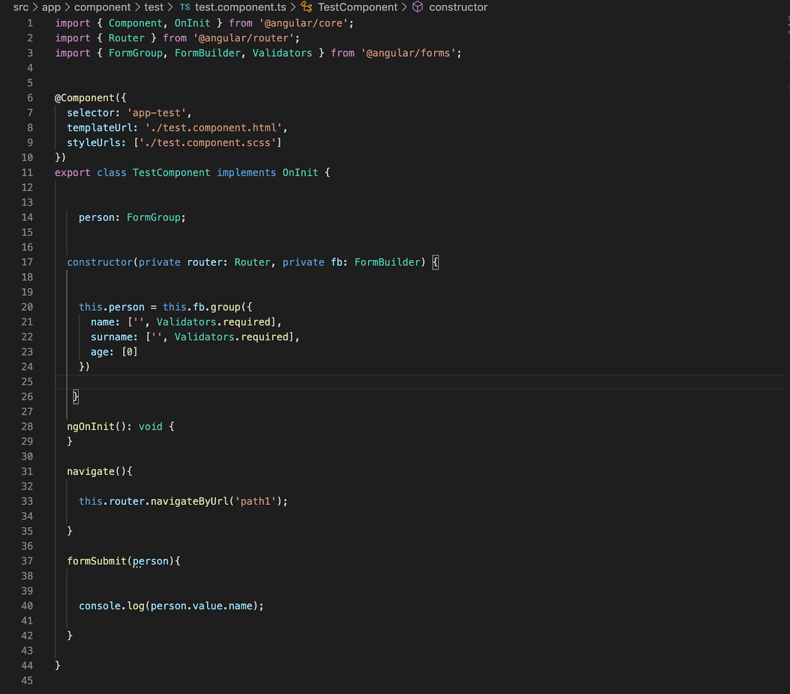

Take a look the example below;

To be able to work with ngModel, you are required to import the FormsModule. In the screenshot below, I have imported both the FormsModule and the ReactiveFormsModule due to the fact that we will work with angular forms. It is always advisable to import both of them because majority of the time you end up using both the combination of ngModel and angular forms 

ngModel forms part of the formsModule which we need to import into the app.module.ts file. Refer to the screenshot below. 

You will see that all angular modules are always added to the imports array of the app.module.ts file. Refer back the documentation(https://angular.io/api/forms/NgModel) for further insights of ngModel.

## Example Of Angular Forms

If you refer to the screenshots below you will be able to see a basic example of being able to work with angular forms. 

The formGroup from the above screenshot helps perform a two way data binding between the html and the typescript file. It links the formGroup that is created in the typescript file(test.component.ts) to the html file(test.component.html). This allows for data to be able to be passed from the html page to the typescript file or from the typescript file to the html page.

Refer to the screenshot below to have a look at the typescript file.

The person FormGroup object that is created in the above example is what is then "binded"(Please not binded is not a real word) to the html. If you refer back to the html screenshot you will notice that formSubmit method in the above typescript file is linked by the (ngSubmit). 