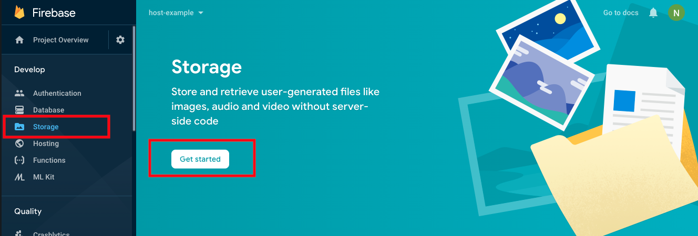

To get started, go to your Firebase console then select storage and get started :

* On the setup Cloud Storage popup, secure rules for cloud storage and set location.
* Once this is done then your storage setup is ready,

