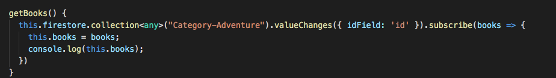

Retrieving data from the cloud firestore can be done in two ways: 

1. Call a get() method 
2. Set a listener using valueChanges()

* Both methods work for retrieving data, the listener method helps getting real time data as the database gets updated.

* Using valueChanges().subscribe() enables you to get the updated data all the time in real time. You won’t need to refresh to see new added data on the database 
* When running this method you will get all the data under the “category-Adventure” collection and the log will be like this:

